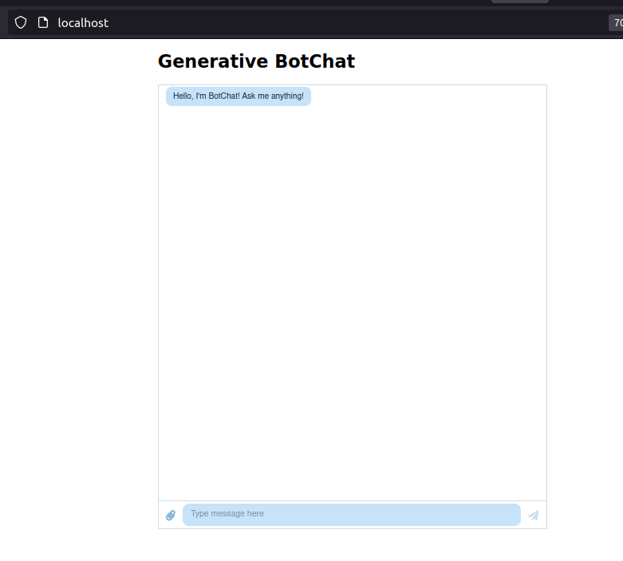

React App
---------

## Deploy the frontend

Here is how you can run the frontend: first go inside the ```react_app``` directory from the root directory
```script
$ cd react_app

```
then run the following command (just below the command, we display its output)

```script
$ docker compose up -d
[+] Building 356.5s (22/22) FINISHED                                            
 => [frontend internal] load build definition from Dockerfile              0.6s
 => => transferring dockerfile: 32B                                        0.0s
 => [frontend internal] load .dockerignore                                 0.8s
 => => transferring context: 2B                                            0.0s
 => [frontend] resolve image config for docker.io/docker/dockerfile:1.4    1.3s
 => CACHED [frontend] docker-image://docker.io/docker/dockerfile:1.4@sha2  0.0s
 => [frontend internal] load .dockerignore                                 0.0s
 => [frontend internal] load build definition from Dockerfile              0.0s
 => [frontend internal] load metadata for docker.io/library/node:lts       1.4s
 => [frontend internal] load metadata for docker.io/library/nginx:alpine   0.0s
 => [frontend development 1/6] FROM docker.io/library/node:lts@sha256:f46  0.0s
 => [frontend stage-3 1/5] FROM docker.io/library/nginx:alpine             0.0s
 => [frontend internal] load build context                               189.1s
 => => transferring context: 117.59MB                                    188.3s
 => CACHED [frontend development 2/6] WORKDIR /app                         0.0s
 => CACHED [frontend development 3/6] COPY package.json /app/package.json  0.0s
 => CACHED [frontend development 4/6] COPY package-lock.json /app/package  0.0s
 => CACHED [frontend development 5/6] RUN yarn install                     0.0s
 => [frontend development 6/6] COPY . /app                               114.8s
 => [frontend build 1/1] RUN yarn build                                   35.5s
 => CACHED [frontend stage-3 2/5] COPY --from=build /app/.nginx/nginx.con  0.0s 
 => CACHED [frontend stage-3 3/5] WORKDIR /usr/share/nginx/html            0.0s 
 => CACHED [frontend stage-3 4/5] RUN rm -rf ./*                           0.0s
 => CACHED [frontend stage-3 5/5] COPY --from=build /app/build .           0.0s
 => [frontend] exporting to image                                          1.0s
 => => exporting layers                                                    0.0s
 => => writing image sha256:103345be5b864fd9d409739331a1a7db23d75a41ab396  0.1s
 => => naming to docker.io/library/react_app-frontend                      0.1s
[+] Running 2/2
 ✔ Network react_app_default  Created                                      1.7s 
 ✔ Container frontend         Started                                     11.9s
 ```
 Navigate to your favourite browser  at http://localhost:
 

 Stop and remove the containers

```script
$ docker compose down
Stopping frontend ... done
Removing frontend ... done
Removing network react_app_default
```